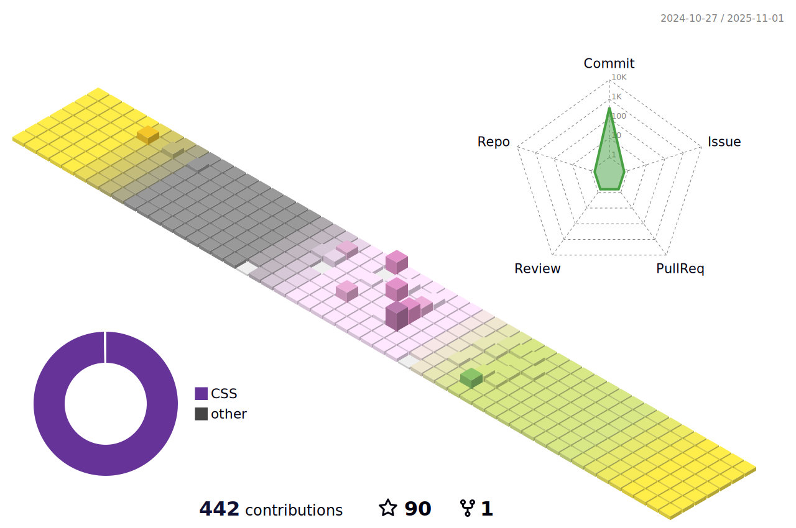

<h1 align="center">Hi 👋, I'm ZhangYHe</h1>
<h3 align="center">A student in BIT.</h3>

<p align="center"> 
   
   
   
</p>

<div align="center">
  
</div>

 <h3 align="center">
  
<!--   -->
  
</h3>

<!--
- 🔭 I’m currently working on **BITFSAE**
-->

- 📫 How to reach me **r1maxzhang@gmail.com** or **2434379504@qq.com**

<div> &nbsp;</div>
<!--
<p align="center" >
  
</p>
-->

<!--
<h3 align="center">Recent Activity:</h1>
-->

<!--START_SECTION:activity-->

<!--END_SECTION:activity-->

<!-- Metrics -->
<!--
<h3 align="center">🛠 Languages and Tools:</h3>
<div align="center">
  
  
  
  
  
  
  
  
  
  
  
  
  
  
</div>

<div> &nbsp;</div>

<div align="center">
  
  
  
  
  
  
  
  
  
  
</div>

<div> &nbsp;</div>

<div align="center">
  
  
  
  
  
  
  
  
  
  
</div>

<div> &nbsp;</div>

<div align="center">
  
  
  
  
  
  
  
  
  
  
  
  
</div>

<div> &nbsp;</div>

<div align="center">
  
  
  
  
  
  
</div>

<div> &nbsp;</div>

<div align="center">
  
  
  
  
  
    
  
  
</div>

<div> &nbsp;</div>

<div align="center">
  
  
  
  
  
  
  
  
  
  
  
  
  
  
  
  
  
  
  
  
  
  
</div>

<div> &nbsp;</div>

<div align="center">
  
  
  
  
  
  
  
  
  
  
  
  
  
  
  
  
  
  
</div>
-->

<div> &nbsp;</div>

<!--START_SECTION:waka-->

```txt
From: 13 April 2023 - To: 28 July 2024

Total Time: 389 hrs 6 mins

Python                  190 hrs 26 mins ████████████░░░░░░░░░░░░░   48.03 %
Java                    44 hrs 54 mins  ██▓░░░░░░░░░░░░░░░░░░░░░░   11.33 %
V                       35 hrs 43 mins  ██▒░░░░░░░░░░░░░░░░░░░░░░   09.01 %
Markdown                20 hrs 23 mins  █▒░░░░░░░░░░░░░░░░░░░░░░░   05.14 %
JSON                    19 hrs 13 mins  █▒░░░░░░░░░░░░░░░░░░░░░░░   04.85 %
C++                     16 hrs 19 mins  █░░░░░░░░░░░░░░░░░░░░░░░░   04.12 %
Bash                    15 hrs 3 mins   █░░░░░░░░░░░░░░░░░░░░░░░░   03.80 %
Text                    13 hrs 21 mins  █░░░░░░░░░░░░░░░░░░░░░░░░   03.37 %
Vue.js                  7 hrs 43 mins   ▒░░░░░░░░░░░░░░░░░░░░░░░░   01.95 %
Other                   7 hrs 23 mins   ▒░░░░░░░░░░░░░░░░░░░░░░░░   01.86 %
```

<!--END_SECTION:waka-->

<!--START_SECTION:waka new-->

<!--END_SECTION:waka new-->
<!--
<p align="center"> 
  <a href="https://github.com/ryo-ma/github-profile-trophy"></a> 
</p>
 -->
 
 <!--
<p></p>

<p>&nbsp;</p>
-->

<!--
 <h3 align="center">Connect with me:</h3>
<p align="center">
<a href="https://kaggle.com/yunhezhang" target="blank"></a>
<a href="https://www.leetcode.com/r1max" target="blank"></a>
</p>
-->

<h3 align="center">
  


</h3>

<h3 align="center">
  


</h3>

<!--
<h3 align="center">Recent Games:</h3>
-->

 <h3 align="center">About me:</h3>
 
 <h3 align="center"><details> <summary>Click here</summary>
  

  
</details></h3>
 
 
 
 
<!--  -->
<!-- <p>&nbsp;</p><p></p>-->

<!-- ### Hi 👋 I'm ZhangYHe   
    
- 🔭 I’m currently working on BITFSAE   

[](https://github.com/anuraghazra/github-readme-stats)   

[](https://github.com/anuraghazra/github-readme-stats)

<!--
**ZhangYHe/ZhangYHe** is a ✨ _special_ ✨ repository because its `README.md` (this file) appears on your GitHub profile.

Here are some ideas to get you started:

- 🔭 I’m currently working on ...
- 🌱 I’m currently learning ...
- 👯 I’m looking to collaborate on ...
- 🤔 I’m looking for help with ...
- 💬 Ask me about ...
- 📫 How to reach me: ...
- 😄 Pronouns: ...
- ⚡ Fun fact: ...
-->
